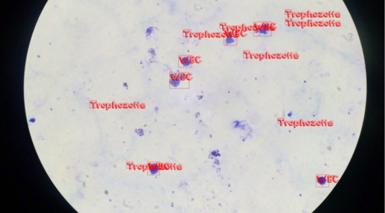
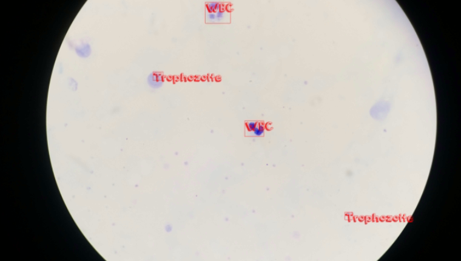
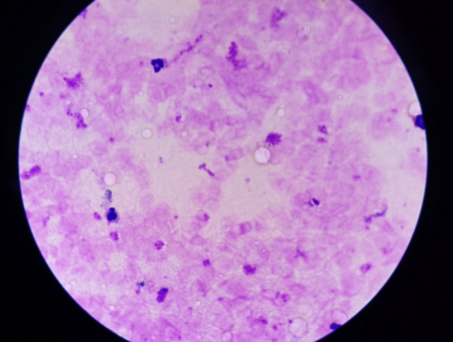

# YOLO-for-Malaria-Parasite-Multiclass-Object-Detection
Multiclass object detection model for identifying malaria parasites in blood smear images, designed to support fast and accurate diagnosis in resource-limited settings.

 
    
    
    

